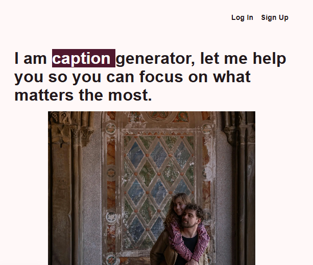
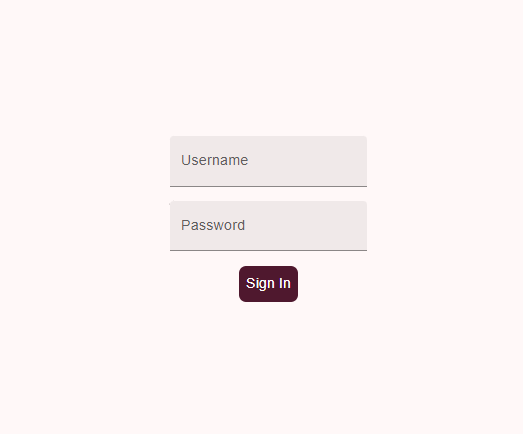

# Caption Generator
The following project was generated as a web app for the visual studio code extension accesibility-helper
> **Note**: This webApp is still under development
# Tech Stack
**Front-end**: React (Next.JS) , TailwindCSS
**Backend**: Python (FastAPI)
**Database**: Postgres (Supabase)

#Run Locally
```
clone https://github.com/Mgalinri/captionGenerator.git
cd caption-generator
npm install
# Start a virtual environment before starting the backend
cd ..
cd backend
pip install -r requirements.txt
```
> This project was generated using supabase, but it can be run without it given that for now is not using storage.
> 
# Future Improvements
- [ ] Authenticaction and Authorization
- [ ] File handling per user
- [ ] Improve UI

# Features
1. An image in any format 
## Images




# License
Licensed under MIT License.
